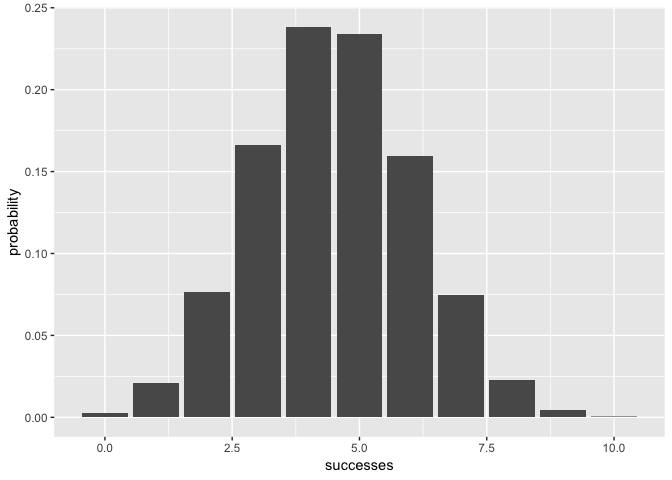
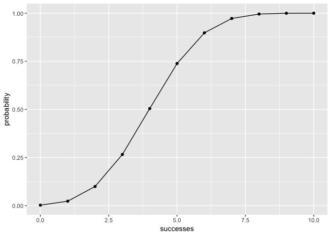

README
================
Mokssh Surve
01/05/2019

## Overview

-----

`binomial` is a minimal package in R that provides users with functions
to solve and plot basic probability distributions. The following are the
functions binomial has to offer:

  - `bin_choose(n, k)`  
  - `bin_probability(success, trials, prob)`  
  - `bin_distribution(trials, prob)`
      - `plot.bindis()`  
  - `bin_cumulative(trials, prob)`
      - `plot.bincum()`  
  - `bin_variable(trials, prob)`
      - `print.binvar()`  
      - `summary.binvar()`  
      - `print.summary.binvar()`  
  - `bin_mean()`
  - `bin_variance()`
  - `bin_mode()`
  - `bin_skewness()`
  - `bin_kurtosis()`

Note: For explanations on the purpose of each of the functions, refer to
introduction.Rmd in vignettes/

## Motivation

-----

This package was created as part of Workout 3 (a small project of sorts)
as part of the syllabus for Stat133 offered by UC Berkeley, and taught
by Professor Gaston Sanchez (& GSI Colin Kou).

## Usage

-----

Note: For detailed usage examples of each function, refer to
introduction.Rmd in vignettes/

``` r
library(binomial)
library(ggplot2)

#The probability of getting 5 heads in 10 tosses of a loaded coin with 45% chance of heads:
bin_probability(success = 5, trials = 10, prob = 0.45)
#> [1] 0.2340327

#The probability distribution of successes in 10 tosses of a loaded coin with 45% chance of heads:
dist <- bin_distribution(trials = 10, prob = 0.45)
#it's plot
plot(dist)
```

<!-- -->

``` r

#The cumulative probability distribution of successes in 10 tosses of a loaded coin with 45% chance of heads:
dist2 <- bin_cumulative(trials = 10, prob = 0.45)
#it's plot
plot(dist2)
```

<!-- -->

``` r

#The creation of a binomial random variable and printing summary
bin1 <- bin_variable(trials = 10, p = 0.3) 
summary(bin1)
#> "Summary Binomial" 
#> 
#> Paramaters 
#> - number of trials: 10 
#> - prob of success : 0.3 
#> 
#> Measures 
#> - mean: 3 
#> - variance: 2.1 
#> - mode: 3 
#> - skewness: 0.276026223736942 
#> - kurtosis: -0.123809523809524

#The finding of the skewness statistic of a a binomial random variable
bin_skewness(10, 0.3)
#> [1] 0.2760262
```
